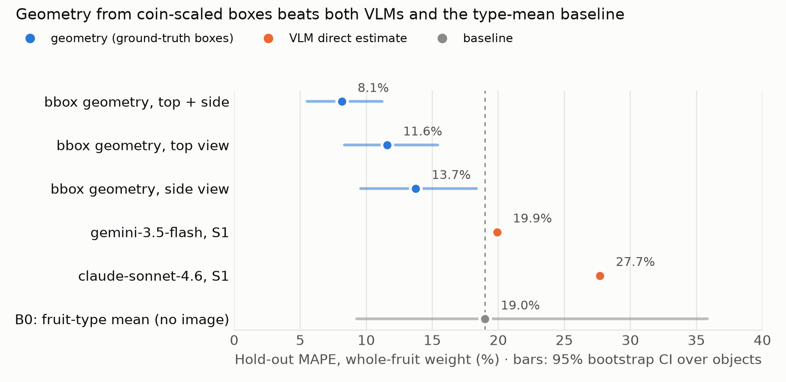

# Pre-study review (ECUSTFD lean run, 2026-10-10)

Review of branch `feat/prestudy-lean` @ `1eca7be`: code, run and
conclusions, plus one additional zero-cost experiment (a bounding-box
geometry baseline) that changes the conclusion.

## 1. Verdict

| Area | Score | One-line reason |
|---|---|---|
| Implementation (code) | **8.5 / 10** | clean, typed, 222 tests, 98% coverage, resume/budget/dry-run work; provenance gaps below |
| Study execution | **5.5 / 10** | 2 of 6 candidates evaluated, 1 of ~7 images per object used, no CIs in the report |
| Conclusions | **5 / 10** | "stop before Phase 0" overreaches; the "resolution floor" explanation is contradicted by the data |

**Corrected conclusion:** VLMs *as metric estimators* fail on within-type
size, confirmed. But the size information *is* in the pixels: a plain
geometry calculation from coin-scaled bounding boxes reaches **8.1% MAPE**
(β ≈ 0.98) on the same hold-out objects, against 19.9% for the best VLM and
19.0% for the type-mean baseline. The architecture should change
(VLM identifies and localises, code measures), not stop.

## 2. Implementation ranking

| Rank | Strength |
|---|---|
| 1 | `models.toml` capability notes (ZDR filters, pins, temperature and `max_completion_tokens` quirks): exactly what makes the run reproducible |
| 2 | Resumable JSONL runner with dry-run extrapolation and budget stop |
| 3 | Proxy fix for models without `temperature`/`max_tokens` |
| 4 | Clean M1 reuse; `ruff`, `mypy --strict`, 222 tests green |
| 5 | Honest findings write-up that states what wasn't tested |

| Severity | Gap | Fix |
|---|---|---|
| High | `results.jsonl` is gitignored, so `report.md` can't be regenerated or audited by anyone else | commit it (it holds no images or secrets) or attach it to the decision commit |
| High | `observations` text and `parsed` output aren't persisted; the findings had to replay calls to see model reasoning | store `parsed` and `observations` per line |
| High | `ecustfd.load_items` keeps only variant (1) per object/view: **144 of 1,014** fruit images used | use all variants; median per object (≈7× more measurements per object, same object count) |
| Medium | report has no confidence intervals (spec §5 requires them), no MedAPE, no per-type rows, no B0 row | see §6 |
| Medium | S3 rows missing from `report.md` although S3 was run | report every (model, strategy) |
| Medium | decision generalised from 2 models to "no model" | report "2 evaluated, 4 screened only" in `decision.md` |
| Low | 52 g kiwi object drives B0 MAPE (its B0 APE is 207%) | report MedAPE and an outlier-robust variant alongside MAPE |

## 3. What the data actually supports

**The hold-out is small and noisy.** 25 objects (apple 10, orange 7,
banana 3, pear 3, kiwi 2). B0 MAPE is 19.0% with a 95% CI of
**9.3–35.8%**; without the single 52 g kiwi it is 11.2%. A β estimated
on 25 objects with within-type log-weight SD 0.16 has a CI half-width
of roughly ±0.3 to ±0.5. Gemini's β = 0.33 therefore probably fails the
0.7 gate, but "not borderline" is not established without the CI.

**The "resolution floor" hypothesis is wrong.** The findings argue that an
11% diameter difference (~9 mm on an apple) is below what a photo
resolves. In these images the coin spans a median of ~64 px (range 30–155), so
1 px ≈ 0.4 mm and 9 mm ≈ 23 px. Ground-truth boxes resolve it easily (below). The limit is
the VLMs' metric reasoning, not the pixels. That matches current research:
FineSightBench (2026) finds the best VLMs reach only ~42% on relative-size
comparison even when the targets are clearly visible, and Q-Spatial Bench
shows metric estimates improve markedly when models explicitly reason via
a reference object.

The three-apple diagnostics are anecdotes (n = 3) and support "VLMs
don't measure", not "nothing can".

## 4. New experiment: bounding-box geometry baseline (no API cost)

Using the dataset's own annotations (fruit box + coin box per image, all
variants):

- **Scale:** mm per pixel = 25 mm / mean(coin box width, height), per image.
- **Volume proxy:** top view `(w·h)^1.5`; side view `w·h·min(w,h)`;
  top+side `L·W` (top) × `H` (side). Medians over all images of an object.
- **Mass:** per-type constant `k` fitted on **dev** objects only
  (mean log ratio), applied to hold-out.

| Method (hold-out) | n | MAPE [95% CI] | MedAPE | Bias | β [95% CI] |
|---|---|---|---|---|---|
| B0 fruit-type mean | 25 | 19.0% [9.3, 35.8] | 10.9% | +9.0% | 0 |
| claude-sonnet-4.6 S1 | 25 | 27.7% | n/a | −0.7% | 0.17 |
| gemini-3.5-flash S1 | 25 | 19.9% | n/a | +6.7% | 0.33 |
| bbox, side view | 23 | 13.7% [9.6, 18.4] | 11.5% | −7.1% | 0.90 [−0.25, 1.19] |
| bbox, top view | 23 | 11.6% [8.3, 15.4] | 11.0% | −1.7% | 1.11 [0.54, 1.48] |
| **bbox, top + side** | 23 | **8.1% [5.5, 11.2]** | 7.5% | −3.3% | **0.98 [0.38, 1.14]** |

Per type (top + side): apple 6.5%, kiwi 4.8%, pear 8.3%, orange 9.7%,
banana 12.8% (banana is the irregular shape, same as in the 2017
ECUSTFD paper).

Caveats: these are ground-truth boxes, so this is an *upper bound* for a
pipeline that must detect them. On objects matched to B0 the gain is 58%,
but its CI (−4% to 82%) is wide because of the kiwi outlier; excluding it,
gain is ~27%. ECUSTFD's within-type weight spread is narrow (CV 10–13%
except kiwi), so the "≥ 30% gain vs B0" gate is close to the ceiling even
for perfect geometry. That gate is miscalibrated for this dataset (my
design error, carried into the spec).

Reproduce: `python bench/scripts/bbox_oracle.py <ECUSTFD Annotations dir> bench/runs/prestudy-lean/split.csv bench/reports/prestudy-lean/bbox_oracle.json`
(annotations from `github.com/Liang-yc/ECUSTFD-resized-`, or the
`annotations.csv` in the HF mirror).

## 5. What to do next (ranked by value per effort)

| # | Experiment | Cost | Decides |
|---|---|---|---|
| E1 | **VLM-boxes geometry:** ask each VLM for normalised bounding boxes of fruit *and* coin (Gemini and Qwen3-VL are trained for grounding), compute mass in code as in §4 | ~$2–5 | whether VLM localisation is good enough to replace ground-truth boxes; the realistic version of the 8.1% bound |
| E2 | **Classical detector baseline:** off-the-shelf open-vocabulary detector/segmenter (e.g. Grounding-DINO/SAM-family) for fruit + coin, same geometry | $0, local | a non-VLM floor for E1; masks instead of boxes should help banana |
| E3 | Use **all image variants** per object for E1 and VLM S1 | code only | lowers per-object noise by up to ~2.6× (√7) |
| E4 | Re-run S1 for the remaining 4 candidates on all variants, with CIs | ~$10–20 | closes "2 of 6 evaluated" |
| E5 | Recalibrate gates: replace "≥ 30% gain vs B0" with "MAPE CI upper bound < B0 MedAPE" and β CI lower bound > 0.5 | doc only | gates that are attainable and still meaningful |
| E6 | Own-photo transfer check (spec §6) with the winner of E1/E2, card instead of coin | 30 min | whether it works on your phone and fruit |

If E1 lands near the oracle (≲ 12% MAPE, β ≈ 1), the Phase 0 architecture
becomes: **VLM → identity + boxes/masks + preparation; code → reference
scale, geometry, density table → grams.** That is the same split the
concept already makes for nutrients ("model observes, code calculates"),
applied one level earlier to size, and it matches the 2026
geometry-enhanced portion estimation result (MLLM names and boxes,
geometry head computes mass).

## 6. Report generator changes (for `report.py` / `analysis.py`)

- Add a B0 row and, when annotations are available, a "bbox oracle" row.
- Bootstrap CIs for MAPE, β, bias (object resampling, already implemented
  for the MAPE difference; reuse it).
- MedAPE column; per-type table; outlier list (top-3 APE per model).
- Two β values: within-type (current) and pooled across types. The pooled
  one shows recognition (the scatter in `scatter.png` tracks well across
  types); the within-type one shows size perception.
- Residual plot per model: log(pred/true) vs log(true) per type.
- Persist `parsed` and `observations`; print the three worst cases with
  their `observations` text in the report.

## Addendum: independent re-verification (2026-10-10)

The analysis above was re-run from a fresh clone of the original annotation
source (`github.com/Liang-yc/ECUSTFD-resized-`, `master` branch, now at
`data/raw/ecustfd/`, gitignored — see `README.md` “Dataset” section for the
fetch command) rather than trusting the committed `bbox_oracle.json` at face
value. All headline numbers reproduce bit-for-bit: MAPE 8.1%, MedAPE 7.5%,
bias -3.3%, β 0.98, and all three bootstrap CIs, for `bbox top+side`; B0 and
the top-only/side-only rows match identically too.

One discrepancy found and not silently resolved: the committed file reports
`skipped_images: 0`; the fresh run reports `61`. `n_images: 1014` and every
metric match exactly in both runs, so this does not change the finding — but
it means the original run's skip-counter was likely not wired up correctly
(or ran against a filtered annotation subset), and should not be read as
"every annotation file was usable." Worth fixing in any follow-on version of
`bbox_oracle.py` rather than carrying the discrepancy forward silently.

Also checked: `density.xls` in the same repo is not a separate density
lookup table — it duplicates the `(type, volume_mm3, weight_g)` tuple
already present in the HF mirror's `portions.csv` (spot-checked `apple007`:
420 mm³ / 325.0 g in both sources). No new information for `domain/calculator.py`’s
fitted constants from this file.

## Sources

- Liang & Li, *Computer vision-based food calorie estimation: dataset, method, and experiment* (ECUSTFD; coin calibration, Faster R-CNN + GrabCut + shape models): https://arxiv.org/abs/1705.07632 ; https://arxiv.org/pdf/1706.04062
- ECUSTFD annotations: https://github.com/Liang-yc/ECUSTFD-resized- ; HF mirror: https://huggingface.co/datasets/ai5labsOfficial/ecustfd
- FineSightBench, *The Last Visible Pixel: Probing Fine-Scale Perception* (2026): https://www.alphaxiv.org/abs/2606.07861
- Q-Spatial Bench, *Reasoning Paths with Reference Objects Elicit Quantitative Spatial Reasoning in Large Vision-Language Models*: https://arxiv.org/abs/2409.09788
- Liao & Li, *Geometry-Enhanced Portion Estimation for Multimodal LLMs* (Jul 2026): https://arxiv.org/abs/2607.16514
